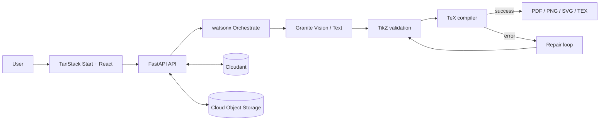

# Sketch2TikZ AI

<p align="center">
  <a href="https://www.ibm.com/watsonx"></a>
  
  
  
  
</p>

Sketch2TikZ AI turns hand-drawn sketches, images, PDFs, and natural-language prompts into clean, editable LaTeX TikZ diagrams. It combines IBM watsonx.ai and Granite models with a FastAPI backend, an automated validation and compilation pipeline, and a modern browser workspace.

> [!NOTE]
> The application is under active development. Some cloud integrations and export workflows require IBM Cloud credentials and a local TeX installation.

## Features

- Sketch, image, PDF, and text-to-TikZ workflows
- AI-assisted diagram understanding and TikZ generation
- Syntax validation, compilation, and automatic repair attempts
- Live code editing and diagram preview
- Project history, favorites, templates, and sharing views
- PDF, PNG, SVG, and `.tex` export paths
- Optional IBM Cloudant and Cloud Object Storage persistence
- IBM watsonx Orchestrate tool endpoints

## Architecture



For the complete component and data-flow diagram, open the [interactive architecture blueprint](docs/sketch2tikz_architecture.html).

## Technology stack

| Layer | Technologies |
| --- | --- |
| Frontend | React 19, TanStack Start, TanStack Router, Vite, TypeScript, Tailwind CSS |
| Backend | Python, FastAPI, Pydantic, Uvicorn |
| AI | IBM watsonx.ai, Granite vision and text models |
| Orchestration | IBM watsonx Orchestrate |
| Persistence | IBM Cloudant, IBM Cloud Object Storage, local fallback storage |
| Compilation | `pdflatex` / TeX Live |
| Deployment | Vercel frontend, Docker-compatible backend |

## Getting started

### Prerequisites

- [Bun](https://bun.sh/) for the frontend
- Python 3.11+
- A TeX distribution containing `pdflatex` for local compilation
- IBM Cloud credentials for watsonx.ai, Cloudant, and Object Storage features

### Frontend

```bash
git clone https://github.com/Shubham56277/Sketch2TikZ-AI.git
cd Sketch2TikZ-AI
bun install
cp .env.example .env.local
bun run dev
```

Set `VITE_API_BASE_URL` in `.env.local` to the FastAPI server URL. The frontend development server is then available at `http://localhost:3000`.

### Backend

```bash
cd backend
python -m venv .venv
# Windows: .venv\Scripts\activate
# macOS/Linux: source .venv/bin/activate
pip install -r requirements.txt
uvicorn app.main:app --reload --port 8000
```

Create `backend/.env` and configure the services you want to enable:

```dotenv
WATSONX_API_KEY=
WATSONX_PROJECT_ID=
WATSONX_URL=https://us-south.ml.cloud.ibm.com

CLOUDANT_URL=
CLOUDANT_APIKEY=
CLOUDANT_DB_NAME=sketch2tikz_projects

COS_API_KEY=
COS_INSTANCE_CRN=
COS_ENDPOINT=https://s3.us-south.cloud-object-storage.appdomain.cloud
COS_BUCKET=sketch2tikz-assets

ALLOWED_ORIGINS=http://localhost:3000
```

Never commit `.env` or `.env.local`; both are ignored by Git.

## Development commands

```bash
# Frontend
bun run dev
bun run build
bun run lint

# Backend tests (from backend/)
pytest
```

## Project structure

```text
Sketch2TikZ-AI/
├── src/                  # React routes, components, hooks, and API client
├── public/               # Static frontend assets
├── backend/
│   ├── app/
│   │   ├── agents/       # watsonx prompts, client, and response parsing
│   │   ├── api/          # HTTP and Orchestrate endpoints
│   │   ├── compiler/     # LaTeX validation and compilation
│   │   ├── database/     # Cloudant integration
│   │   ├── services/     # Generation and project workflows
│   │   └── storage/      # Cloud and local asset storage
│   └── tests/            # Backend test suite
└── docs/                 # Architecture documentation
```

## API documentation

With the backend running locally:

- Swagger UI: `http://localhost:8000/docs`
- ReDoc: `http://localhost:8000/redoc`
- Health check: `http://localhost:8000/api/health`

## Live demo

[sketch2tikz.vercel.app](https://sketch2tikz.vercel.app/)

## Author

Developed by **Shubham Mankar** as an IBM SkillsBuild project.
